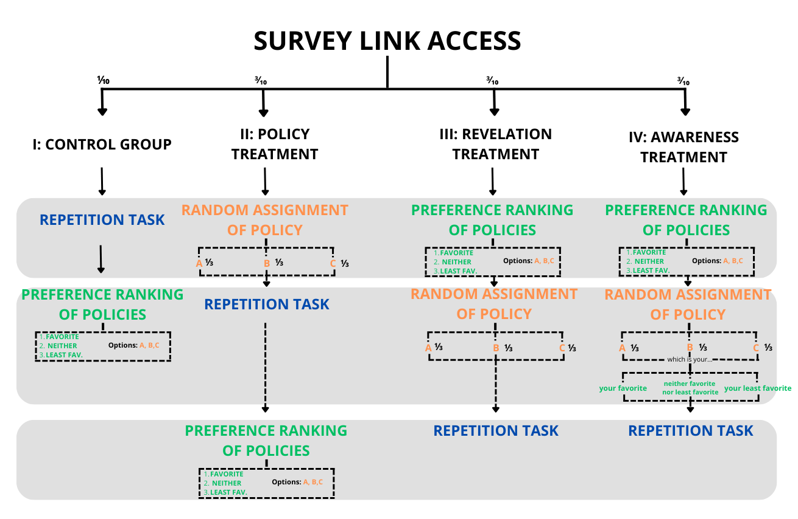

```{r setup, include=FALSE}
tables_path <- "../../3. Output/tables/"
figures_path <- "../../3. Output/figures/"
```

# Exploring teacher’s repetition biases with a survey experiment {.diapositiva-titulo style="background: none;" data-menu-title="Titulo"}


::: {style="text-align: center; margin-top: 1em; margin-bottom: 1em"}
::: {layout="[[1,1]]"}
::: column
Antonio Alfonso

Pablo Brañas

María Castro

Ignacio Garijo

Diego Jorrat
:::
::: column
Iria Mata

Anxo Sánchez

Ainara Zubillaga

Michelle K. Quintero

Alfonso Echazarra
:::
:::
:::


## El preregistro consta de dos partes

::: {layout="[[1,1]]"}
::: column

### Caracterización

- Se crean medidas de harshness del profesor
- Se utilizan las preguntas socioeconómicas y de comportamiento para intentar caracterizar a los profesores más duros (Random Forest)
:::

::: column

### Hipótesis

- Se testean hipótesis sobre el comportamiento de los profesores dependiendo de sus gustos sobre las políticas y de si esos gustos con complacidos. 

- Se muestran los resultados con tablas de regresiones y algún gráfico

:::

:::

# La caracterización {.diapositiva-titulo-seccion}

## Las medidas de harshness son similares entre ellas


     
::: callout
::: {style="font-size: 1.3em;"}
- **Ha**: tasa de repetición
- **Hb**:  Media de la desviación entre la decisión del profesor y la media del resto para una tarjeta i
- **Hc**: Media de la desviación entre la decisión del profesor y la probabilidad de suspender de una tarjeta i según un modelo logit alimentado con las características del alumno
- **Hd**: Igual que Hc pero añadiendo las variables de primaria/secundaria y titularidad del centro

:::
:::

## Modelo Random Forest

::: panel-tabset

### Modelo 

- Se utiliza la segunda medida (hb) para el análisis, debido a que hb, hc, y hd son prácticamente iguales (correlación +0.995). Incluye las variables explicativas: 

::: callout
::: {style="font-size: 1.3em;"}

- Primaria
- Experiencia
- Antigüedad
- Edad
- Nº grupos de docencia
- Autopercepción del impacto en los estudiantes
- Confianza en la meritocracia
- Empatía
- Titularidad colegio
- Contrato
- Sexo
:::
:::

### Fit

Aquí medimos la correlación porque queremos saber la capacidad explicativa del modelo (fit), no su capacidad de predicción.


### Importancia de las variables

El modelo elige qué variables han sido más importantes para el cálculo del modelo (mide cuánto aumenta el error del modelo cuando se aleatorizan los valores de cada variable en vez de tomar los valores reales)


### Valores SHAP

Como los coeficientes de un logit/probit, pero observación a observación: cada punto muestra cuánto aporta cada variable a la predicción para esa observación.

Ejemplo: para la variable "age" el color del punto oscurece con la edad. El profesor más mayor es menos "duro". Pero también tenemos el matiz de que vemos que los jóvenes (verde claro) tienen una distribución muy poco concentrada...


### Logit

::: {layout="[[1,1]]"}
::: column
Si se replicara esto con un modelo Logit, los coeficientes quedarían así: 
:::

::: column

:::
:::
:::


# Las hipótesis {.diapositiva-titulo-seccion}

## Los estudios

El análisis se compone de 4 estudios: 

1. Compara grupo de control con grupo policy
2. Compara grupo policy con grupo revelation
3. Compara grupo revelation con grupo Awareness
4. Otros




## H11

::: panel-tabset

### Hipótesis

Teachers’ harshness is not correlated with being assigned to policies. This means that teachers assigned to the Policy Treatment are not harder than those from the Control Group.

### Fórmula

$$
\begin{equation}\label{eq:h11}
    \boldsymbol{H_j}= \lambda_{1|1} D_1 %+\boldsymbol{\beta_{1|1} X_1}
\end{equation}
$$
**Discussion: ** A negative $\lambda_{1|1}$ would mean that being exposed to the policies has a negative effect on the harshness level of the teachers.

### Resultados
<iframe src="`r paste0(tables_path, 'h11.html')`" width="100%" height="500" frameborder="0"></iframe>
:::

## H12

::: panel-tabset

### Hipótesis

Teachers’ harshness is not correlated with being assigned to a specific policy.

### Fórmula

$$
\begin{equation}\label{eq:h12}
    \boldsymbol{H_j} = \boldsymbol{\lambda_{1|2}^{\Omega^\prime}} \boldsymbol{D_{\Omega^\prime}} + \boldsymbol{\gamma'_{1|2} F'} %+\boldsymbol{\beta_{1|2} X_1}
\end{equation}
$$
Where $\boldsymbol{\lambda_{\Omega^\prime}}$ is a vector of coefficients for the vector of binary variables created by the categorical variable $\boldsymbol{D_{\Omega^\prime}} \in [0,1,2,3]$ depending on if the subject was assigned to the Control Group and thus no policy ($D_{\Omega^\prime}=0$), Policy A ($D_{\Omega^\prime}=1$), Policy B  ($D_{\Omega^\prime}=2$), or C ($D_{\Omega^\prime}=3$). In addition, vector $\boldsymbol{\gamma' F'}$ controls for the favorite policy of the teacher. 

**Discussion:** significant coefficients would imply that teachers act differently depending on which policy they receive from the assignment, regardless if they like it or not.

### Resultados
<iframe src="`r paste0(tables_path, 'h12.html')`" width="100%" height="500" frameborder="0"></iframe>


:::

## H13

::: panel-tabset

### Hipótesis

Teachers’ harshness is not correlated with the alignment of teacher’s preferences and their policy assignment.

### Fórmula

$$
\begin{equation}\label{eq:h13}
    \boldsymbol{H_j}= \boldsymbol{\phi P} + \boldsymbol{\lambda_{1|3}^\Omega} \boldsymbol{D_\Omega} %+\boldsymbol{\beta_{1|3} X_1}
\end{equation}
$$

Where $\boldsymbol{\phi}$ is a vector of coefficients for the binary variables created from $\boldsymbol{P} \in [0,1,2]$ if teacher $j$ was assigned to control group ($P=0$), their favorite policy ($P=1$), or their least favorite policy ($P=2$). $\boldsymbol{\lambda_{1|3}^\Omega}$ is a vector of coefficients for the binary variables created by the categorical variable $D_\Omega$ which can take value 1 (Policy A), 2 (B) or 3 (C).

**Discussion:** This study will help us clarify if teachers are harder under a situation they are not keen on, or when they are forced into a policy they do not appreciate. This is discussed further in studies II and III.

### Resultados
<iframe src="`r paste0(tables_path, 'h13.html')`" width="100%" height="500" frameborder="0"></iframe>


:::


## H21

::: panel-tabset

### Hipótesis

Teachers’ harshness is not correlated with being asked to rank the policies before policy assignment. This means that teachers assigned to the Revelation Treatment are not harder than those from the Policy Treatment.

### Fórmula

$$
\begin{equation}\label{eq:h21}
    \boldsymbol{H_j}= \lambda_{2|1} D_2 %+ \boldsymbol{\beta_{2|1} X_1}
\end{equation}
$$

Where $\lambda_{2|2}$ is the coefficient for treatment variable $D_2$, which takes value 1 when the teacher belongs to treatment III and 0 when they belong to treatment II.

**Discussion:** a positive significant coefficient would mean that a teacher in treatment III is harder than a teacher in treatment II.

### Resultados
<iframe src="`r paste0(tables_path, 'h21.html')`" width="100%" height="500" frameborder="0"></iframe>

:::

## H22

::: panel-tabset

### Hipótesis

Teachers’ harshness is not correlated with being assigned to a specific policy after having ranked them.

### Fórmula

$$
\begin{equation}\label{eq:h22}
    \boldsymbol{H_j} = \lambda_{2|2} D_2 +\boldsymbol{\lambda_{2|2}^\Omega} \boldsymbol{D_\Omega} +  \boldsymbol{\lambda_{2|2}} D_2 \boldsymbol{D_\Omega} + \boldsymbol{\gamma_{2|2}' F'} %+\boldsymbol{\beta_{2|2} X_1}
\end{equation}
$$

Here, the policy assignment variable ($\boldsymbol{D_\Omega}$) and the treatment assignment variable ($D_2$) interact with each other to study the interaction between policy and treatment random assignment. 

**Discussion:** significant $\lambda_{2|2}$ coefficients could point in the direction that some policies have an effect on the harshness when presented after preferences are revealed.


### Resultados
<iframe src="`r paste0(tables_path, 'h22.html')`" width="100%" height="500" frameborder="0"></iframe>

:::

## H23

::: panel-tabset

### Hipótesis

Teachers’ harshness is not correlated with the alignment of teacher’s preferences and their policy assignment when teacher’s have ranked the policies before assignment.

### Fórmula

$$
\begin{equation}\label{eq:H23}
    \boldsymbol{H_j}= \lambda_{2|3} D_2 +  \boldsymbol{\gamma_{2|3}' F'} %+ \boldsymbol{\beta_{2|3} X_1}
\end{equation}
$$

where $\lambda_{2|3}$ symbolizes the coefficient for binary variable $D_2$ that takes value 1 when the subject belongs to treatment III and 0 when they belong to treatment II. 

**Discussion:** a positive significant coefficient $\lambda_{2|3}$ for subsample $n_F^{2,3}$ would suggest that teachers are less harsh when given what they have chosen as their favorite policy. Similarly, a negative significant coefficient $\lambda_{2|3}$ for subsample $n_{LF}^{2,3}$ would suggest that teachers retaliate when given a policy they have stated as their least favorite. If proven, we would call that *boycott effect*.

### Resultados
<iframe src="`r paste0(tables_path, 'h23.html')`" width="100%" height="500" frameborder="0"></iframe>

:::

## H31

::: panel-tabset

### Hipótesis

Teachers’ harshness is not correlated with acknowledging their opinion of the policy they are being assigned to.

### Fórmula

$$
\begin{equation}\label{eq:h31}
    \boldsymbol{H_j}= \lambda_{3|1} D_3 %+ \boldsymbol{\beta_{3|1} X_1}
\end{equation}
$$

**Discussion:** a coefficient $\lambda_{3|1}$ significantly different than zero would convey treatment effects.

### Resultados
<iframe src="`r paste0(tables_path, 'h31.html')`" width="100%" height="500" frameborder="0"></iframe>

:::

## H32

::: panel-tabset

### Hipótesis

Teachers’ harshness is not correlated with being made aware of their opinions when assigning a specific policy.

### Fórmula

$$
\begin{equation}\label{eq:h32}
    \boldsymbol{H_j} = \lambda_{3|2} D_3 +\boldsymbol{\lambda_{3|2}^\Omega} \boldsymbol{D_\Omega} +  \boldsymbol{\lambda_{3|2}} D_3 \boldsymbol{D_\Omega} + \boldsymbol{\gamma'_{3|2} F'} %+\boldsymbol{\beta_{3|2} X_1}
\end{equation}
$$

 **Discussion:** Coefficients $\lambda_{3|2}$ significantly different than zero could be possible if, for instance, the level of implication of a teacher with the policy assigned to them varies between Treatments III and IV.
 
### Resultados

<iframe src="`r paste0(tables_path, 'h32.html')`" width="100%" height="500" frameborder="0"></iframe>

:::

## H33

::: panel-tabset

### Hipótesis

Teachers’ harshness is not correlated with the alignment of teacher’s preferences and their policy assignment in a setting where they are aware of the alignment or disalignment.

### Fórmula

$$
\begin{equation}\label{eq:h33}
    \boldsymbol{H_j}= \lambda_{3|3}^{F,LF} D_3 +  \boldsymbol{\gamma_{3|3}' F'} %+ \boldsymbol{\beta_{3|3} X_1}
\end{equation}
$$

**Discussion:** Here, a coefficient $\lambda_{3|3}^F$ ($\lambda_{3|3}^{LF}$) significantly different than zero would mean that teachers are significantly more lenient (harsh) when assigned to a policy they like (dislike) with an explicit message for it.

### Resultados

<iframe src="`r paste0(tables_path, 'h33.html')`" width="100%" height="500" frameborder="0"></iframe>

:::

## H41

::: panel-tabset

### Hipótesis

Current decisions are independent of previous decisions in the repetition task. This is a test on moral licensing, which will tell us if teacher’s compensate their previous decisions with the present ones.

### Fórmula

$$
\begin{equation}\label{eq:ar1}
    \gamma_{j,i,t}= \rho_{t-1} \gamma_{j,i,t-1} + \rho_{t-2} \gamma_{j,i,t-2} 
\end{equation}
$$


Where $\gamma_{j,i,t} =1$ if teacher $j$ fails student $i$ at interaction $t \in [1,8]$, and 0 if the decision is passing the student.

### Resultados
No he sabido estimarlos al no saber el orden en el que cada profesor ha visto las tarjetas. 
:::

## H42

::: panel-tabset

### Hipótesis

Policy preferences are orthogonal to policy assignment. This is a test on conformity. Here, we explore if being assigned to a policy has any impact in the later revealed preferences for treatment II.

### Fórmula

$$
\begin{equation}\label{eq:h42}
    \log\left(\frac{P^{\Omega}_i}{1-P^\Omega_i} \right)=  \lambda_{4|2} D_\omega %+ \boldsymbol{\beta_{4|2} X_1}
\end{equation}
$$

Where the outcome variable is the probability of choosing a policy $\Omega$ as favorite; $\lambda_{4|2}$ is the coefficient for binary variable $D_\omega$, that takes value 1 when the subject has been assigned to the same policy $\Omega$ and 0 when they have been assigned to a different one.

### Resultados
<iframe src="`r paste0(tables_path, 'h42.html')`" width="100%" height="500" frameborder="0"></iframe>

:::

## H43

::: panel-tabset

### Hipótesis

Treatment assignment has no effect on policy preferences. This tests if the treatments distorted teachers’ policy preferences.

### Fórmula

We study if preferences are dependent on the treatment. To study this, we will show a figure with the probability of assigning a policy $\Omega$ as favorite or least favorite by treatment with their standard errors.

### Resultados

::: panel-tabset
### Favorite


### Least-favorite

:::

:::


## Extras: Visualización alternativa alineación preferencias/asignación

Las hipótesis 3 de cada estudio analizan si la alineación de las preferencias y la asignación de la política tienen efecto en la *dureza*. También se puede ver de esta manera: 

::: panel-tabset

### Favorito


### Menos favorito


:::


